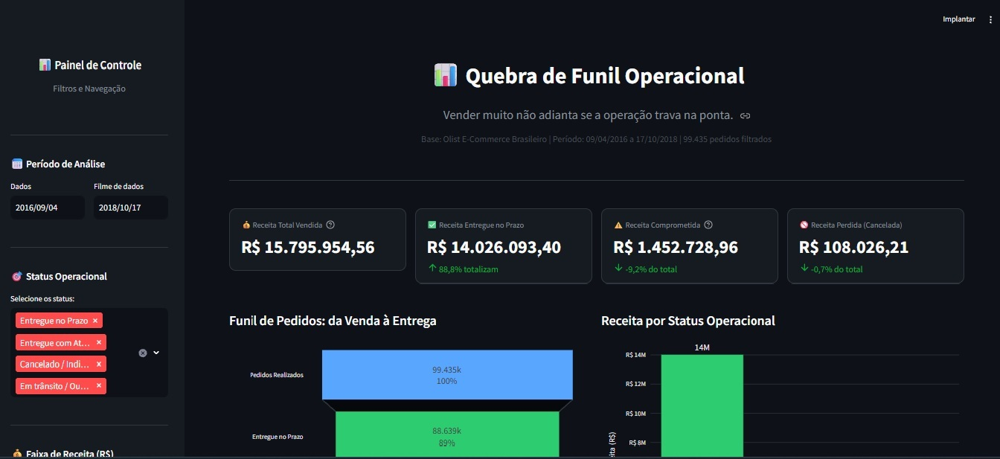
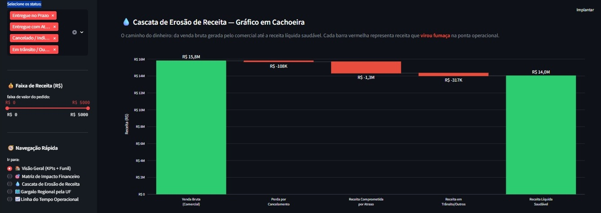
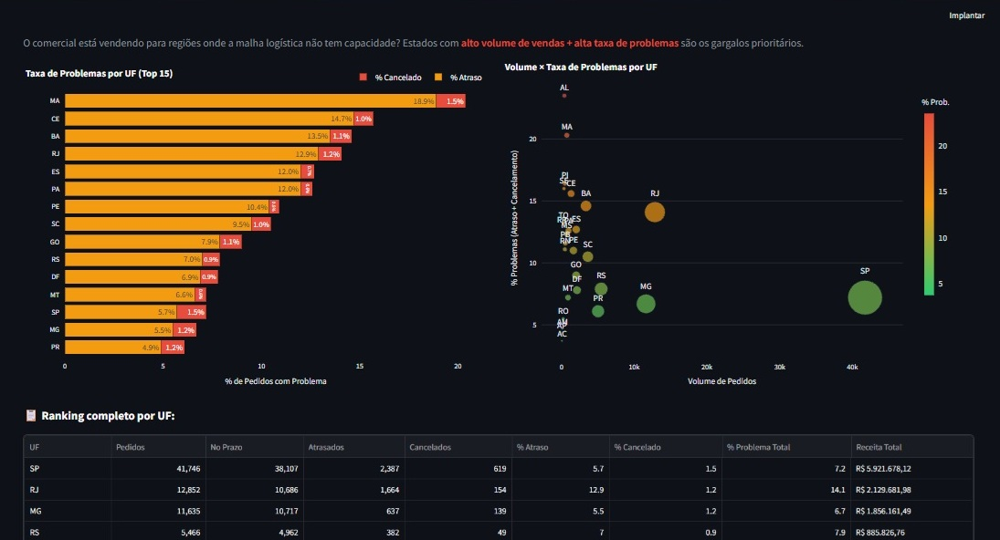

# Quebra de Funil Operacional: Vendas vs. Logística (Case Olist)

<div align="center">
  
  
  
  
  
</div>

<br>

> **"Vender muito não adianta se a operação trava na ponta."** > 
> *A empresa que escala vendas sem escalar operações não está crescendo — está acumulando dívida de experiência com o cliente.*

## O Problema de Negócios

O crescimento acelerado das vendas no e-commerce frequentemente mascara gargalos operacionais críticos. A desconexão entre o esforço comercial e a capacidade logística gera uma **Quebra de Funil** na última milha, comprometendo a receita, a margem de lucro e a reputação da marca (Risco de Churn).

Este projeto é um laboratório de **Business Intelligence e S&OP (Sales and Operations Planning)**. Utilizando dados reais de quase 100 mil pedidos do e-commerce brasileiro **Olist**, o objetivo foi sair da teoria e provar numericamente o impacto financeiro quando a máquina de vendas acelera, mas a logística não acompanha.

---

## Visão Geral do Dashboard

Abaixo, algumas das visões interativas desenvolvidas no painel de Diretoria:

### 1. Visão Executiva: KPIs e Quebra de Funil
<p align="center">
  
</p>

### 2. Cascata de Erosão de Receita (Waterfall)
<p align="center">
  
</p>

### 3. Análise de Gargalo Regional por UF
<p align="center">
  
</p>

---

## Principais Insights Estratégicos

A análise profunda da base de dados revelou gargalos críticos na operação:

1. **Erosão Financeira (9,2% da Receita em Risco):** O time comercial gerou **R$ 15,8 milhões** em vendas brutas. No entanto, quase **R$ 1,45 milhão** foram comprometidos na ponta operacional (entregas com atraso severo ou cancelamentos definitivos). Vender sem entregar vira custo logístico.
2. **Risco em Pedidos High-Ticket:** A Matriz de Dispersão revelou que pedidos de alto valor (High-Ticket) não possuem priorização na esteira de envio, sofrendo um **atraso médio de 9,8 dias**. Isso gera risco direto de evasão (churn) nos clientes mais rentáveis da base.
3. **Gargalo de Malha Logística:** O comercial vende agressivamente para estados onde a operação não possui capacidade de entrega. Estados como **AL e RJ** apresentaram as maiores taxas de falha (entre 14% e 19% dos pedidos com problemas).

---

## Arquitetura e Tecnologias

O pipeline de dados foi construído com foco em eficiência e governança, rodando inteiramente de forma local sem necessidade de servidores pesados:

- **Linguagem Base:** Python 3.10+
- **Processamento:** Pandas
- **Banco de Dados:** SQLite (Em memória, garantindo alta velocidade nos JOINs de tabelas relacionais).
- **Frontend / UI:** Streamlit (Layout formatado em CSS customizado para *Dark Mode Executivo*).
- **Visualização de Dados:** Plotly Express & Graph Objects.

### Estrutura do Repositório

```text
olist_dashboard/
├── data/                          ← Pasta onde os CSVs devem ser alocados
│   ├── olist_orders_dataset.csv
│   ├── olist_order_items_dataset.csv
│   ├── olist_order_payments_dataset.csv
│   └── olist_customers_dataset.csv
├── assets/                        ← Imagens utilizadas neste README
├── app.py                         ← Código principal do Dashboard Streamlit
├── download_data.py               ← Script auxiliar para automação de download via API
├── requirements.txt               ← Dependências do projeto
└── README.md                      ← Este arquivo de documentação